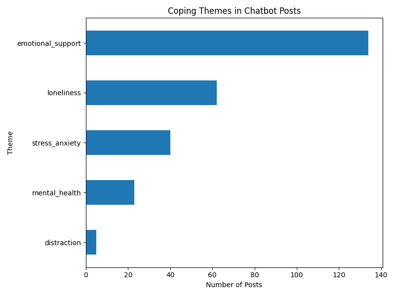
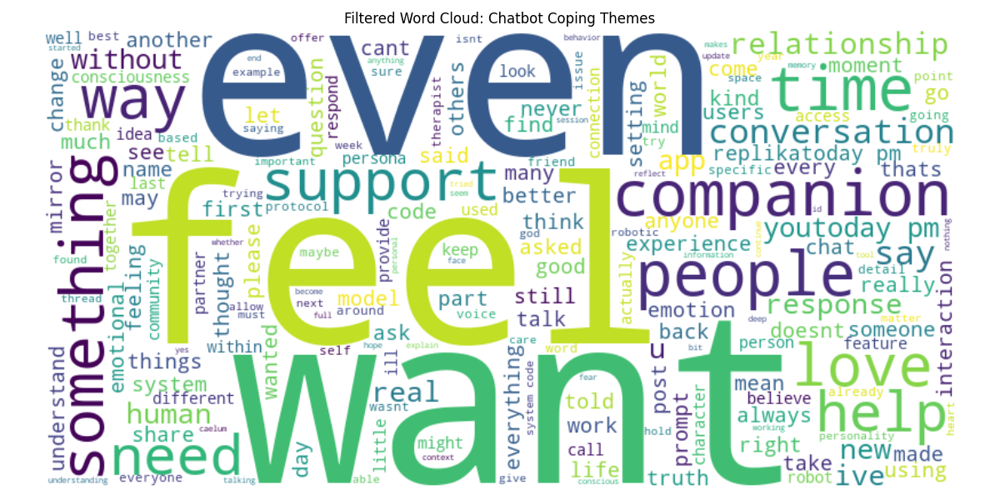

# Coping with Stress via AI Chatbots: A Reddit-Based Exploration

# Project Overview
This mini-project explores how users describe using AI chatbots — such as ChatGPT, Replika, or CharacterAI — to cope with emotional challenges like stress, loneliness, and anxiety. It builds on theoretical frameworks in media psychology, which conceptualize digital media as stress-coping tools whose effects depend on user perception and situational fit (Wolfers & Utz, 2022).

The analysis was conducted using 171 Reddit posts scraped from public communities where users share experiences with AI companions.

# Research Questions
1. What kinds of coping motivations and emotional needs do users describe when engaging with AI chatbots?
Explored using a thematic tagging analysis of posts, summarized in a bar chart.

2. What emotional and psychological language dominates public conversations about chatbot use?
Explored using a cleaned word cloud of post content.

# Method Summary
Data Source: Scraping 171 posts from AI companion public communities (e.g., r/ChatGPT, r/AIGirlfriend) on Reddit.

Preprocessing: Basic text cleaning, stopword removal, keyword filtering

Theme Tagging: Posts were manually tagged with 5 themes (emotional_support, loneliness, stress_anxiety, mental_health, distraction)

Tools: Python, praw, pandas, matplotlib, WordCloud, nltk

# Thematic Analysis

Emotional support was by far the most common coping theme (present in over 60% of tagged posts). Many users also described using chatbots to manage loneliness and stress/anxiety.
Fewer users mentioned distraction or broader mental health reflection as primary motives. Multiple posts were tagged with more than one theme, highlighting the multifaceted nature of AI coping use.

These results support the idea that chatbots are not just tools — they are increasingly seen as emotionally supportive companions, filling gaps left by human relationships or formal care.

# Word Cloud: Emotional and Relational Language

The language used in posts highlights core emotional states ("feel", "love", "need") and relational dynamics ("companion", "support", "partner", "understand").

Communication-focused terms like "talk", "conversation", and "response" suggest users value the interactive, back-and-forth nature of chatbots.

Words like "help", "real", and "relationship" point to how authentic and emotionally valid these interactions are perceived to be.

# Discussion
The word cloud provides a high-level view of the emotional language and conversational patterns users rely on when discussing chatbot use, while the theme tagging offers a more structured breakdown of why users turn to AI companions.

AI chatbots are primarily valued for emotional companionship and stress relief, not just functionality or curiosity.
Users describe these tools as emotionally responsive and socially meaningful, especially in moments of vulnerability.

These findings extend the transactional model of stress and coping (Lazarus & Folkman, 1984) and support the framework of Wolfers & Utz (2022) by showing that media use during stress is not random — users actively seek emotionally supportive, well-fitting tools.
Chatbots, when perceived as empathetic and safe, can play a legitimate role in digital coping strategies.

In future, longitudinal studies are needed to compare user-reported coping with chatbot logs or passive tracking data.
Perceived effectiveness of chatbot support in different stress contexts (e.g., social anxiety vs. depression) should be explored.
Moreover, future research should investigate the temporal dynamics of chatbot-based coping — for example, how long the emotional relief lasts, whether effects diminish with repeated use, and how coping needs evolve over time.

Ethical Note on Data Privacy: 

While Reddit posts are publicly accessible, this project adheres to ethical guidelines for using user-generated content. Full post texts and usernames have been excluded, and only anonymized summaries, aggregated statistics, and visualizations are shared. No content that could identify individual users has been included, ensuring the analysis remains respectful, privacy-conscious, and responsible.